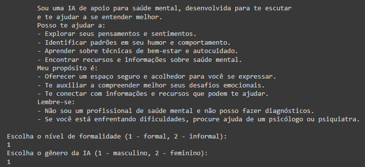
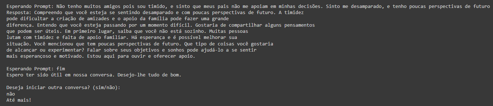

### IA para Apoio Emocional - Projeto Desabaf-AI 
Este é o repositório do projeto Desabaf-AI, desenvolvido como parte do Intensivão de Produção de Projetos com Inteligência Artificial da Alura. O objetivo principal deste projeto é fornecer uma plataforma onde os usuários podem desabafar anonimamente e conversar com uma IA de forma rápida e eficiente. Além disso, a IA é capaz de detectar estados emocionais críticos nos usuários e recomendar a busca por um profissional de saúde mental quando necessário.

###  Desenvolvimento
Este projeto foi desenvolvido utilizando Jupyter e Google Colab. O Google Colab foi utilizado para o desenvolvimento e implementação da integração com a API da IA Gemini. A IA Gemini é uma ferramenta poderosa de análise de texto que oferece recursos avançados de processamento de linguagem natural. Neste projeto, ela foi utilizada para fornecer suporte emocional aos usuários e detectar estados emocionais críticos.

### Funcionalidades Principais
Desabafo Anônimo e Conversa Rápida: Os usuários podem compartilhar seus sentimentos e preocupações de forma anônima e conversar com a IA psicóloga de forma rápida e eficiente, recebendo suporte emocional.

Detecção de Estado Crítico: A IA para Apoio Emocional utiliza a API da IA Gemini para analisar o conteúdo compartilhado pelos usuários e determinar seu estado emocional. Quando detecta que um usuário está em um estado emocional crítico, ela oferece recomendações e recursos para procurar ajuda profissional. Importante notar que ela não substitue o profissional de forma alguma, mas confere uma assistente para ajudar. Assim sendo, entendemos a Desabaf-AI como uma poderosa ferramenta de democratização da saúde mental, visto que tal saúde, um tanto quanto elitizada, não só é cara como de díficil acesso a grande parte da população brasileira.

### Resultado prático

Print dos resultados de uma conversa de testes com a IA

    <h2>Preparação</h2>
    
    

    <h2>Começo da conversa</h2>
    

     <h2>Final da conversa</h2>
    

### Autor

- [Marco Lúcio Morastoni Leiteinski Filho](https://github.com/marcomorastoni)

Este projeto foi desenvolvido como parte do Intensivão de Produção de Projetos com Inteligência Artificial da Alura.

